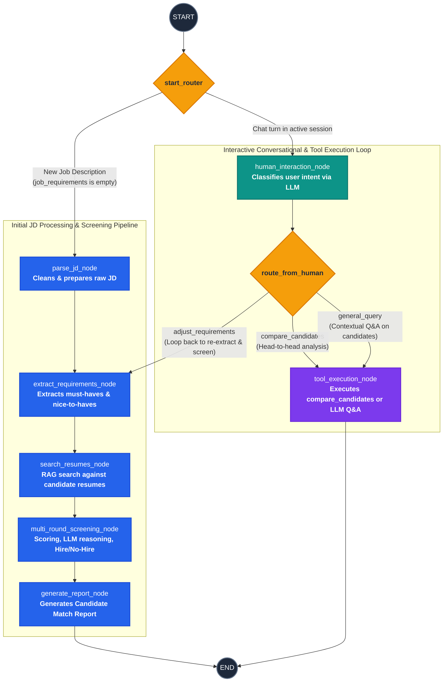

# System Architecture: Agentic Profile Matching

This document provides a detailed architectural blueprint for the Agentic Profile Matching system, based on the project requirements. It serves as a comprehensive reference for the implementation phase.

## 1. High-Level System Overview
The system is an AI-powered conversational agent built using **LangGraph**. It acts as an intelligent recruiter capable of ingesting job descriptions, extracting requirements, matching them against a resume database (using RAG), executing a multi-round screening process, and interacting with users via a **Gradio** chat interface.

---

## 2. Agent State Design (`State`)

The core of the LangGraph agent is its State. The state object will be passed between nodes and mutated at each step. It should be implemented as a `TypedDict` or a `Pydantic` model.

```python
from typing import TypedDict, List, Dict, Any

class AgentState(TypedDict):
    conversation_history: List[Dict[str, str]] # List of messages: {"role": "user"|"assistant", "content": "..."}
    job_description: str                       # Raw job description text
    job_requirements: Dict[str, Any]           # Parsed requirements (must-haves, nice-to-haves)
    candidate_shortlist: List[Dict[str, Any]]  # Current active list of candidates with scores
    candidate_reasoning: Dict[str, str]        # Reasoning for each candidate's ranking/selection
    current_phase: str                         # e.g., "InitialScreen", "DeepAnalysis", "FinalRecommendation"
    feedback: str                              # Human feedback provided for iterative refinement
```

---

## 3. Graph Workflow & State Machine (Nodes and Edges)

The system operates as a Directed Cyclic Graph (LangGraph `StateGraph`) with human-in-the-loop iterative feedback loops. The state machine navigates between initial batch screening, candidate evaluation, report generation, and interactive conversational queries.

### 3.1. State Machine Diagram



### 3.2. State Transition & Mutation Table

| From Node / State | Condition / Trigger | Target Node | Mutated State Fields | Purpose |
|---|---|---|---|---|
| `START` | `not job_requirements and job_description` | `parse_jd_node` | &mdash; | Route initial JD upload through screening pipeline |
| `START` | Existing session message | `human_interaction_node` | `conversation_history` | Route user chat queries in active session |
| `parse_jd_node` | Sequential | `extract_requirements_node` | `job_description` | Cleans raw text string |
| `extract_requirements_node` | Sequential | `search_resumes_node` | `job_requirements`, `job_description` | Uses `extract_requirements` tool to generate JSON skills and experience criteria; appends user feedback if re-extracting |
| `search_resumes_node` | Sequential | `multi_round_screening_node` | `candidate_shortlist` | Invokes `rag_search` tool using extracted criteria |
| `multi_round_screening_node` | Sequential | `generate_report_node` | `candidate_shortlist`, `candidate_reasoning`, `current_phase` | Filters to top 5 candidates, prompts LLM for qualitative reasoning per candidate, assigns "Hire"/"No-Hire" status |
| `generate_report_node` | Sequential | `END` | `conversation_history`, `feedback` | Appends formatted Markdown match report to chat; completes current graph execution |
| `human_interaction_node` | Intent: `adjust_requirements` | `extract_requirements_node` | `feedback` (`"adjust_requirements"`) | Re-enters extraction with user-adjusted criteria and re-runs search & screening |
| `human_interaction_node` | Intent: `compare_candidates` | `tool_execution_node` | `feedback` (`"compare_candidates"`) | Dispatches to head-to-head comparison tool |
| `human_interaction_node` | Intent: `general_query` | `tool_execution_node` | `feedback` (`"general_query"`) | Dispatches to conversational LLM with candidate shortlist context |
| `tool_execution_node` | Sequential | `END` | `conversation_history` | Appends tool/agent answer to history; returns response to UI |

### 3.3. Nodes (Functions/Agents)
1. **`parse_jd_node`**: Receives the raw Job Description (JD) and strips whitespace.
2. **`extract_requirements_node`**: Uses the `extract_requirements` tool to populate `job_requirements` (must-haves, nice-to-haves). If routed from user feedback, appends new requirements to the existing JD.
3. **`search_resumes_node`**: Interacts with the RAG Search tool (`rag_search`) to query the resume database based on the extracted requirements.
4. **`multi_round_screening_node`**:
    - *Round 1 (Initial Screen):* Sorts candidates by similarity score and extracts the top candidates.
    - *Round 2 (Deep Analysis):* Invokes the LLM to write qualitative reasoning on strengths and gaps for each candidate.
    - *Round 3 (Final Decision):* Assigns definitive "Hire" or "No-Hire" status based on score thresholds.
5. **`generate_report_node`**: Compiles the findings into a structured Candidate Match Report and appends it to `conversation_history`.
6. **`human_interaction_node`**: Evaluates the user's latest chat query and uses an LLM classifier to determine intent (`adjust_requirements`, `compare_candidates`, or `general_query`).
7. **`tool_execution_node`**: Executes requested tools (e.g., `compare_candidates`) or answers general inquiries using the candidate shortlist as context.

### 3.4. Edges & Routing Logic
- **`START` &rarr; `start_router` (Conditional Edge):**
  - If `not job_requirements and job_description`: Routes to `parse_jd_node`.
  - Else: Routes to `human_interaction_node`.
- **Pipeline Chain (Direct Edges):**
  - `parse_jd_node` &rarr; `extract_requirements_node` &rarr; `search_resumes_node` &rarr; `multi_round_screening_node` &rarr; `generate_report_node` &rarr; `END`.
- **`human_interaction_node` &rarr; `route_from_human` (Conditional Edge):**
  - `adjust_requirements` &rarr; Routes back to `extract_requirements_node` (feedback loop).
  - `compare_candidates` &rarr; Routes to `tool_execution_node`.
  - `general_query` &rarr; Routes to `tool_execution_node`.
- **`tool_execution_node` &rarr; `END` (Direct Edge).**

---

## 4. Tool Specifications

The agent will be equipped with specific tools to perform its tasks. These should be implemented as LangChain `@tool` functions and bound to the agent.

### 4.1. `extract_requirements`
- **Input:** `jd` (string) - The raw job description.
- **Output:** JSON/Dictionary containing `must_have_skills`, `nice_to_have_skills`, `experience_years`, etc.
- **Purpose:** Used early in the graph to parse the JD and structure the search criteria.

### 4.2. `compare_candidates`
- **Input:** `candidate_ids` (List[string]) - IDs or names of candidates to compare.
- **Output:** A head-to-head structured text or Markdown table comparing strengths, weaknesses, and requirement fulfillment side-by-side.
- **Purpose:** Triggered when the user asks to "Compare the top X matches".

### 4.3. `generate_interview_questions`
- **Input:** `candidate_id` (string).
- **Output:** List of tailored screening questions.
- **Purpose:** Addresses specific gaps or verifies strengths identified during the deep analysis phase.

### 4.4. Existing Tools (From Previous Milestones)
- **`rag_search(query: str)`**: Searches the vectorized resume database to find relevant matches.
- **`file_system_tools`**: Tools for reading raw resume files or storing reports if needed.

---

## 5. Frontend Integration (Gradio Chat Interface)

The `human_interaction_node` connects directly to the Gradio frontend to facilitate the interactive features (Part B of the requirements).

**Gradio Flow:**
1. User provides a Job Description in the UI.
2. The LangGraph pipeline begins execution (`START` &rarr; `generate_report_node`).
3. The UI displays the detailed match report and recommendations in the chat interface.
4. User types a natural language query in the chatbox (e.g., *"Find me candidates with React and 3+ years experience"* or *"Why did John rank higher than Jane?"*).
5. Gradio sends this message to the agent's state (`conversation_history` / `feedback`).
6. The graph processes the input, routes to the appropriate node (or executes tools), and streams the response back to the user.

---

## 6. Recommended Project Structure

```text
RAGBasedProfileMatching/
│
├── matching_agent.py          # Core LangGraph implementation (Nodes, Edges, Graph compilation)
├── state.py                   # State TypedDict/Pydantic definition
├── tools.py                   # Implementation of tools (extract, compare, interview_questions)
├── multi_round_screen.py      # Logic for the 3-round filtering process
├── app.py                     # Gradio frontend interface
├── docs/                      
│   ├── ProblemStatement.md    # Source requirements
│   └── architecture.md        # This architecture blueprint
└── jds/                       # Sample Job Descriptions
```
