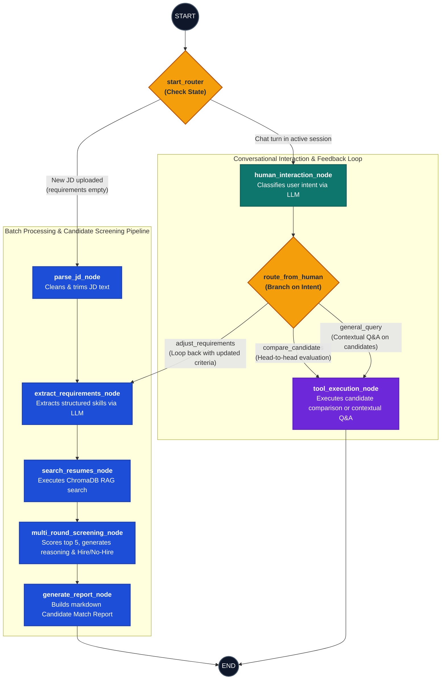
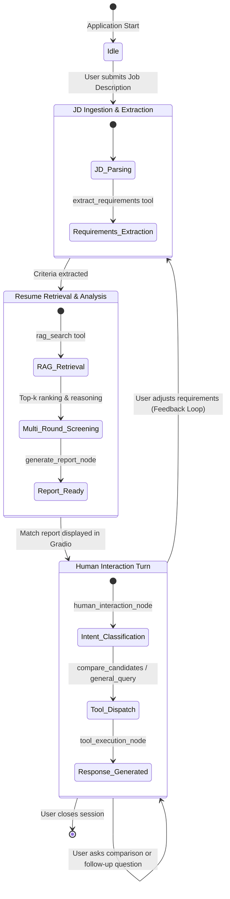

# State Machine & Workflow Specification: Agentic Profile Matching

This document provides a comprehensive state machine specification and visual diagrams for the LangGraph-based conversational screening agent.

---

## 1. Visual Flowchart & State Machine

---

## 2. State Lifecycle Diagram

The agent operates across distinct lifecycle states stored in `AgentState`:

---

## 3. Node Specifications & State Mutations

| Node | Input Fields Consumed | State Fields Mutated / Returned | Description & Tools Used |
|---|---|---|---|
| **`parse_jd_node`** | `job_description` | `job_description` | Strips leading/trailing whitespaces and validates length. |
| **`extract_requirements_node`** | `job_description`, `conversation_history` | `job_requirements`, `job_description` | Calls `extract_requirements` tool. If triggered from user feedback, appends feedback to the JD before extraction. |
| **`search_resumes_node`** | `job_requirements` | `candidate_shortlist` | Invokes `rag_search` querying vector database for matching profiles. |
| **`multi_round_screening_node`** | `candidate_shortlist`, `job_requirements` | `candidate_shortlist`, `candidate_reasoning`, `current_phase` | Sorts by score, selects top 5, invokes LLM to generate individualized match reasoning, and assigns "Hire" (score &ge; 0.5) / "No-Hire". |
| **`generate_report_node`** | `candidate_shortlist`, `candidate_reasoning` | `conversation_history`, `feedback` | Generates a structured markdown "Candidate Match Report" and pushes it to `conversation_history`. |
| **`human_interaction_node`** | `conversation_history` | `feedback` | LLM classifies user message intent into `adjust_requirements`, `compare_candidates`, or `general_query`. |
| **`tool_execution_node`** | `candidate_shortlist`, `conversation_history`, `feedback` | `conversation_history` | Invokes `compare_candidates` tool if requested, or runs general Q&A with candidate context. |

---

## 4. Conditional Edge Details

1. **`start_router(state: AgentState)`**:
   - Condition: `not state.get("job_requirements") and state.get("job_description")` &rarr; Routes to `parse_jd_node`.
   - Otherwise &rarr; Routes to `human_interaction_node`.

2. **`route_from_human(state: AgentState)`**:
   - `feedback == "adjust_requirements"` &rarr; Routes to `extract_requirements_node` (completing the iterative refinement loop).
   - `feedback == "compare_candidates"` &rarr; Routes to `tool_execution_node`.
   - Default / `feedback == "general_query"` &rarr; Routes to `tool_execution_node`.

