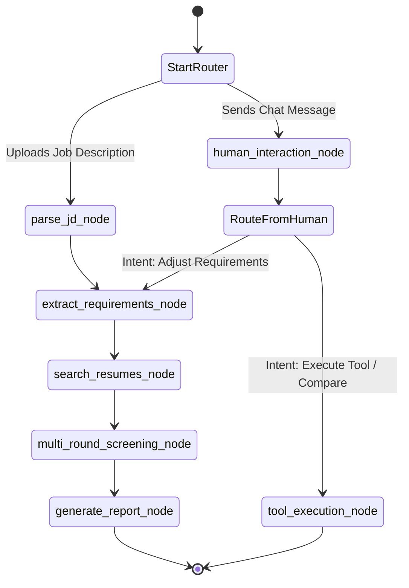

# State Machine Diagram: Agentic Profile Matching

This diagram outlines the LangGraph execution flow for the conversational screening agent.

### Node Descriptions:
- **`parse_jd_node`**: Cleans and prepares the raw text.
- **`extract_requirements_node`**: Leverages the LLM tool to generate a structured JSON of must-haves and nice-to-haves.
- **`search_resumes_node`**: Triggers the RAG pipeline to pull an initial pool of candidates matching the requirements.
- **`multi_round_screening_node`**: Executes the 3-round filtering process (Top 10 -> Deep Analysis -> Final Decision).
- **`generate_report_node`**: Creates the structured markdown match report.
- **`human_interaction_node`**: Evaluates user queries to determine intent (feedback loop).
- **`tool_execution_node`**: Executes requested functions like `compare_candidates` or `generate_interview_questions`.
